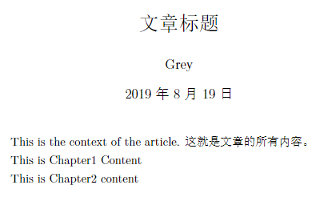

# LaTex

Latex: 论文、排版、公式；
> 交叉引用、目录、注释、角标

Refs:
1. 刘海洋 《LaTeX入门》
2. Tobias Oetiker: 一份不太简短的LATEX 2ε介绍

example: simple example
> 

```tex
% 使用 ctexart 文类，UTF-8 编码
\documentclass[UTF8]{ctexart}
\usepackage{ctex} % use some package for commands

\begin{document}

\title{文章标题}
\author{Grey}
\date{\today}
\maketitle % generate title by above info

\thispagestyle{empty} % no page number

This is the context of the article.
这就是文章的所有内容。

\input{Chapters/ch1.tex}
\input{Chapters/ch2.tex}

\end{document}
```

```tex
% Chapters/ch1.tex
This is Chapter1 Content
````

```tex
% Chapters/ch2.tex
This is Chapter2 Content
```

example: first line indent

```tex
~~~~% 4个空格代表首行缩进
这是另一个内容
```

example: math & math ref jump

```tex
\documentclass[UTF8]{ctexart}
\usepackage[backref]{hyperref} % ref跳转
% \usepackage{mathtools} 默认被引用

\begin{document}

This is the content of the article.

\begin{equation}\label{eq:1}
    E=mc^2
\end{equation}

equation~(\ref{eq:1})

\end{document}
```

example: math format

```tex
% 开头写:
% \usepackage{mathtools}
% \usepackage{bm}

\begin{align}
    E=mc^2+\bm{A}+\rm{diag} % bm是加粗，rm是直体字
\end{align}

% gather表示多行公式居中
\begin{gather}
    \alpha+\beta=\dot{X},\\
    f(x)=a+\left(\frac{x}{y}+666\right)
\end{gather}
% \left(, \right)跟随括号内容改变括号大小

% align &自定义对齐
\begin{align}\label{eq:hello}
    \alpha+\beta&=\dot{X},\nonumber\\
    f(x)&=a+\left(\frac{x}{y}+666\right)
\end{align}

% equation reference
equation~(\ref{eq:hello})
```

example: array

```tex
\documentclass[UTF8]{ctexart}
\usepackage{mathtools}
\begin{document}

This is the context of the article.

% c, l, r: center , left, right
% 因为需要4列，所以有4个c
\begin{align}
    \left[
        \begin{array}{cccc}
            1&0&0&1\\
            1&0&0&1\\
            1&0&0&1\\
            1&0&0&1
        \end{array}
    \right]
\end{align}

\end{document}
```

example: bmatrix

```tex
\documentclass[UTF8]{ctexart}
\usepackage{mathtools}
\begin{document}

This is the context of the article.

\begin{equation}
    \begin{matrix}
        1&0&0&1\\
        1&0&0&1\\
        1&0&0&1\\
        1&0&0&1
    \end{matrix}
\end{equation}

\end{document}
```

example: inline latex

```tex
\documentclass[UTF8]{ctexart}
\usepackage{mathtools}
\begin{document}

This is the context of the article.

$$
\left[
    \begin{matrix} 
        1 & 2 & 3 \\
        4 & 5 & 6 \\
        7 & 8 & 9
    \end{matrix}
\right]
$$

This is inline equation $E=mc^2$

\end{document}
```

example: character escape

```tex
\documentclass[UTF8]{ctexart}
\usepackage{mathtools}
\begin{document}

This is the context of the article.

$$
~Hello\\
\sim\\
{}
world
\{\}
$$
% ~被编译为空格
% \sim才是~
% {}也不会被编译
% \{ 实现转义

% 随着内容变大的花括号
$$
\left\{
\frac{a}{c}
\right\}
$$

\end{document}
```

example: some symbols

```tex
\bigcap
\cap
\bigcup
\cup
\big|
\Big|
\bigg|
\Bigg|
\dot{a}
\ddot{a}
\sqrt{b}
\sqrt[4]{b}
```

example: 大括号中若干项

```tex
\begin{align}
    \left\{
    \begin{aligned}
        E=mc^2,\\
        f(x)=x^2,\\
        y(x)=\frac{a}{b}
    \end{aligned}
    \right.
\end{align}


\begin{align}
    \left.
    \begin{aligned}
        E=mc^2,\\
        f(x)=x^2,\\
        y(x)=\frac{a}{b}
    \end{aligned}
    \right\}
\end{align}
```

example: footnote

```tex
\documentclass[UTF8]{ctexart}
\usepackage{mathtools}
\usepackage[backref]{hyperref}
\begin{document}

This is the context of the article.

\begin{align}\label{eq:1}
    \left\{
    \begin{aligned}
        E=mc^2,\\
        f(x)=x^2,\\
        y(x)=\frac{a}{b}
    \end{aligned}
    \right.
\end{align}

This is equation~(\ref{eq:1})

This is what \footnote{you can find footnote in this page bottom}

\end{document}
```

exampel: figure

```tex
\documentclass[UTF8]{ctexart}
\usepackage{graphicx}
\usepackage[backref]{hyperref}
\begin{document}

\begin{figure}[h]
    \centering
    \includegraphics[width=0.5\textwidth]{pic/mexican.JPG} % 80% width
    \caption{this is caption}
    \label{fig:1}
\end{figure}

This is Figure~(\ref{fig:1})

\begin{figure}[h]
    \centering
    \includegraphics[width=0.32\textwidth]{pic/mexican.JPG}
    \includegraphics[width=0.32\textwidth]{pic/mexican.JPG}
    \includegraphics[width=0.32\textwidth]{pic/mexican.JPG}
    \caption{this is caption}
    \label{fig:2}
\end{figure}

This is Figure~(\ref{fig:2})

\end{document}
```

example: add fig to equation

```tex
\documentclass[UTF8]{ctexart}
\usepackage{mathtools}
\usepackage{graphicx}
\usepackage[backref]{hyperref}
\begin{document}

\begin{align}
    E=mc^2\nonumber\\
    \begin{aligned}
        \includegraphics[]{pic/mexican.JPG}
    \end{aligned}
\end{align}

\end{document}
```

```tex
\documentclass[UTF8]{ctexart}
\usepackage{mathtools}
\usepackage{graphicx}
\usepackage[backref]{hyperref}
\begin{document}

\begin{align}
    E=mc^2\nonumber\\
    \begin{aligned}
        \includegraphics[width=2.0cm]{pic/nn-nna.JPG}
    \end{aligned}
    +
    \begin{aligned}
        \includegraphics[width=2.0cm]{pic/nn-nnb.JPG}
    \end{aligned}
    .\label{two_n}
\end{align}

\end{document}
```

example: add fig to text

```tex
\documentclass[UTF8]{ctexart}
\usepackage{mathtools}
\usepackage{graphicx}
\usepackage[backref]{hyperref}
\begin{document}

% centering
As shown in~$\begin{aligned}\includegraphics[width=2.0cm]{pic/nn-nnb.JPG}\end{aligned}$

% not centering
As shown in~$\includegraphics[width=2.0cm]{pic/nn-nnb.JPG}$

\end{document}
```

example: latex等级
- section
- subsection
- subsubsection
- paragraph

```tex
\documentclass[UTF8]{ctexart}
\begin{document}

\paragraph{This is paragaph 1 title}
~

This is paragraph1 content

\paragraph{This is paragaph 2 title}
~
This is paragraph2 content

\paragraph{This is paragaph 3 title}

This is paragraph3 content

\end{document}
```

example: list

```tex
\documentclass[UTF8]{ctexart}
\usepackage{mathtools}
\usepackage{graphicx}
\usepackage[backref]{hyperref}
\begin{document}

\begin{itemize}
    \item This is item1
    \item This is item2
    \item This is item3
    \item This is item4
\end{itemize}

\begin{enumerate}
    \item This is item1
    \item This is item2
    \item This is item3
    \item This is item4
\end{enumerate}

\end{document}
```

example: `*`

```tex
\documentclass[UTF8]{ctexart}
\usepackage[backref]{hyperref}
\begin{document}

\section{What is LaTeX}

\begin{enumerate}
    \item This is item1
    \item This is item2
    \item This is item3
\end{enumerate}

\section*{How to do }

\begin{itemize}
    \item This is item1
    \item This is item2
    \item This is item3
\end{itemize}

\end{document}
```

example: center text

```tex
\documentclass[UTF8]{ctexart}
\begin{document}

\begin{center}
    Text is centered
\end{center}

\end{document}
```

example: 定理

```tex
\documentclass[UTF8]{ctexart}
\usepackage{amsthm}

\begin{document}

\newtheorem{theorem}{定理}

\begin{theorem}[Placheral's Theorem]
    This is theorem1
\end{theorem}

\begin{theorem}[Grey's Theorem]
    This is theorem2
\end{theorem}

\begin{theorem}[Alpha's Theorem]
    This is theorem3
\end{theorem}

\newtheorem{law}{定律}

\begin{law}[Newton's law]
    This is law1
\end{law}

\begin{law}[Fourier's law]
    This is law2
\end{law}

\end{document}
```

example: piecewise function

```tex
\documentclass[UTF8]{ctexart}
\usepackage{mathtools}

\begin{document}

\begin{align}
    V(x)=\begin{cases}
        0, &0<x<a;\\
        \infty, &x<0, x>a;
    \end{cases}
\end{align}

\begin{align}
    \begin{rcases}
        0, 0<x<a;\\
        \infty, x<0, x>a
    \end{rcases}=V(x)
\end{align}

\end{document}
```

example: space

```tex
\documentclass[UTF8]{ctexart}

\begin{document}

\bm{Grey}

\texrm{Beta}

\emph{James}

hello\quad world

hello\qquad world

\end{document}
```

example: some tricks

```tex
\documentclass[UTF8]{ctexart}
\usepackage{mathtools}
\usepackage{bm}

\begin{document}

$\bm{Grey}$

\textrm{Alpha}

\emph{Moris}

hello\quad world

hello\quad\quad world

hello\qquad world

$ds^2=a^2$

$\textrm{d}s^2=a^2$

$this is not good$

$\text{this is not good}$

$\textrm{this is not good}$

\end{document}
```

example: triangular

```tex
\begin{align}
    sin\theta\\
    \sin\theta\\
    \lim
\end{align}
% \sin is recommended
```

example: table

```tex
\documentclass[UTF8]{ctexart}
\usepackage{mathtools}
\usepackage[backref]{hyperref}

\begin{document}

\begin{table}[!h]
    \begin{center}
        \begin{tabular}{c|c|c}
            \hline
            type & structure & number \\
            \hline
            a & square & 4\\
            b & square & 4\\
            c & square & 4\\
            d & square & 4\\
            \hline
        \end{tabular}
    \end{center}
    \caption{This is a table}
    \label{tb:1}
\end{table}

\begin{table}[!h]
    \begin{center}
        \begin{tabular}{|c|c|c|}
            type & structure & number \\
            \hline
            a & square & 4\\
            b & $E=mc^2$ & 4\\
            c & square & 4\\
            d & square & 4\\
        \end{tabular}
    \end{center}
    \caption{This is a table}
    \label{tb:2}
\end{table}

\begin{table}[!h]
    \begin{center}
        \begin{tabular}{|c|cc|}
            type & structure & number \\
            \hline
            a & square & 4\\
            b & $E=mc^2$ & 4\\
            c & square & 4\\
        \end{tabular}
    \end{center}
    \caption{This is a table}
    \label{tb:3}
\end{table}

see Table~(\ref{tb:1}) and Table~(\ref{tb:2})

\end{document}
```

example: subscripte & upscript, and some tricks

```tex
$A^{\alpha\beta\gamma}_{ijk}$

${A^{\alpha\beta\gamma}}_{ijk}$

$A'^\mu$

% $A^'\mu$  is wrong

% tex中多行等同于一行；多个空格等同于一个空格

% 文中加\footnote会变成编号
% 标题加\footnote会变成星号

% label可以加在equation, figure, table, chapter, section
```

example: reference

```tex

```